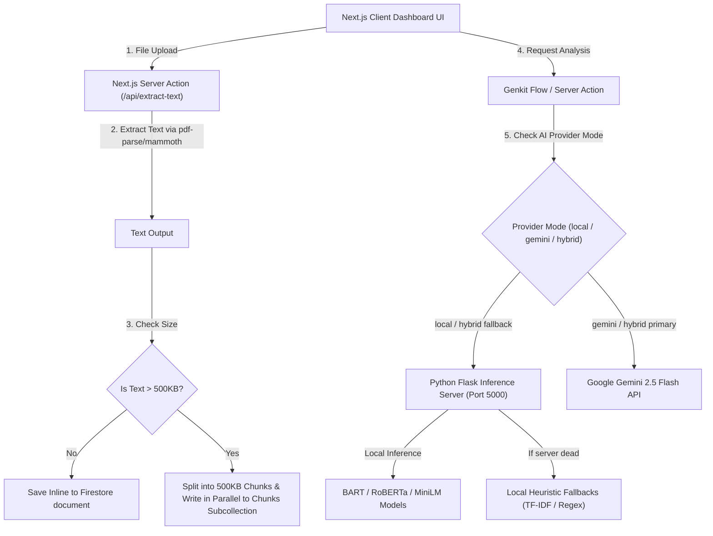

# 🧠 SummarAIze (SmartDoc AI) - Hybrid AI Document Intelligence Platform

SummarAIze is a production-grade, state-of-the-art document intelligence workspace built with **Next.js 15.5**, **React 19**, **Genkit**, **Firebase**, and a **local Python NLP inference server**. It parses massive PDFs and DOCX files (up to 300MB), optimizes storage via parallel Firestore chunking, and offers rich analysis including audience-specific summaries, contextual chat Q&A, mind maps, document comparisons, and tone analytics.

It is engineered to work in **three execution modes**:
1. **Local (Offline-First)**: Fully offline AI pipelines utilizing open-source transformers running on a local Flask server.
2. **Gemini Primary**: Cloud-native execution powered by Google Gemini API.
3. **Hybrid**: A smart combination of both — utilizing local BART and RoBERTa models for summaries, tone analysis, and chat, while leveraging Gemini for complex mind mapping, audio text-to-speech, and comparisons.

---

## 🏗️ System Architecture & Workflow



### 🔁 Request Pipeline:
1. **Ingestion**: Uploaded documents are parsed via Server Actions utilizing `pdf-parse` (for PDF) and `mammoth` (for DOCX) to extract raw clean text.
2. **Firestore Optimization**: Firestore enforces a **1MB document size limit**. To scale for massive files, any document text >500KB is automatically split and saved in parallel to a subcollection (`/chunks`) using concurrent Firebase batch commits.
3. **Inference Execution**: Depending on configured environment settings, requests route either to the local Hugging Face server (port 5000) or Google's Gemini Flash model. If the local Python server is unreachable, smart regex and TF-IDF sentence heuristic models act as local fallbacks to guarantee uninterrupted service.

---

## ✨ Features

- 📝 **Audience-Specific Summaries** - Custom summaries tailored to different readers: *Students* (conceptual), *Lawyers* (regulatory), *Researchers* (evidence/trends), and *General Public* (practical impact).
- 💬 **Contextual Document Chat** - Question Answering with cited references and confidence metrics, preventing LLM hallucinations.
- 🗺️ **Dynamic Mind Maps** - Recursive node visualizers showing concepts, topics, and sub-topics.
- 📊 **Document Comparison** - Side-by-side semantic comparison calculating similarities, differences, and a similarity score.
- 🔊 **Audio Summaries (TTS)** - Text-to-speech audio player to listen to generated summaries.
- 🔍 **Suggested Questions** - Auto-generated context-aware suggestions based on document content.
- 🕰️ **History & Bookmarks** - Save summaries, read logs, and explore recent document logs in an interactive user dashboard.
- 🔒 **Enterprise-Grade Security** - Strict path-based Firebase Security Rules ensuring users can only read and write their own documents.

---

## 📦 Tech Stack

### Frontend & Orchestration
- **Framework**: Next.js 15.5.9 (App Router) & React 19
- **AI Orchestration**: Firebase Genkit SDK
- **Styling & UI**: Tailwind CSS, Radix UI Primitives, Lucide Icons
- **Forms & Validation**: React Hook Form + Zod
- **Database & Auth**: Firebase Auth, Firestore
- **File Parsing**: `pdf-parse`, `mammoth`

### Local NLP Server (Python)
- **Framework**: Flask 3.1.3
- **Deep Learning**: PyTorch 2.10.0 (CUDA/GPU Acceleration & CPU Fallback auto-detection)
- **NLP Models**: 
  - **Summarization**: `facebook/bart-large-cnn` (400M parameters abstractive summarizer)
  - **Contextual Q&A**: `deepset/roberta-base-squad2` (RoBERTa fine-tuned on Stanford Question Answering Dataset)
  - **Tone & Sentiment**: `cardiffnlp/twitter-roberta-base-sentiment-latest`
  - **Semantic Compare**: `sentence-transformers/all-MiniLM-L6-v2` (for cosine similarity matrix calculation between chunks)

---

## 🚀 Installation & Local Setup

### 1. Configure Environment Variables
Create `.env.local` inside the `studio/` directory:
```env
# AI Execution Configuration (hybrid | local | gemini)
AI_PROVIDER=hybrid

# Gemini API Key (Required for Gemini or Hybrid mode)
GOOGLE_GENAI_API_KEY=your_gemini_api_key_here

# Local NLP Server Configuration
NLP_SERVER_URL=http://localhost:5000
PREFER_LIGHTWEIGHT_MODELS=0

# Firebase Configuration
NEXT_PUBLIC_FIREBASE_API_KEY=your_firebase_key
NEXT_PUBLIC_FIREBASE_AUTH_DOMAIN=your_auth_domain
NEXT_PUBLIC_FIREBASE_PROJECT_ID=your_project_id
NEXT_PUBLIC_FIREBASE_STORAGE_BUCKET=your_storage_bucket
NEXT_PUBLIC_FIREBASE_MESSAGING_SENDER_ID=your_messaging_sender_id
NEXT_PUBLIC_FIREBASE_APP_ID=your_app_id
```

### 2. Run Python NLP Inference Server
We recommend setting up a virtual environment:
```bash
# Navigate to studio directory
cd studio

# Create virtual environment
python -m venv venv_nlp

# Activate virtual environment
# Windows:
venv_nlp\Scripts\activate
# macOS/Linux:
source venv_nlp/bin/activate

# Install NLP dependencies
pip install -r requirements_nlp.txt

# Start the Flask NLP Server
python nlp/inference_server.py
```
The local server will start on [http://localhost:5000](http://localhost:5000) and automatically download and cache models on its first execution.

### 3. Run Frontend Next.js Application
Open a new terminal window:
```bash
# Install Node dependencies
npm install

# Run the development server
npm run dev
```
The App dashboard will be available at [http://localhost:9002](http://localhost:9002).

---

## ⚡ Performance Optimizations Applied

- **Parallel Batch Writes**: Writes large document slices (500KB each) to Firestore concurrently, avoiding database locks and complying with Firestore's 500-operation transaction limits.
- **Lazy Loading & Code Splitting**: Non-critical dashboard views and charts are imported dynamically via `next/dynamic` to speed up Initial Page Load.
- **Hardware Acceleration**: Automatic GPU device detection using PyTorch to drastically reduce transformer model computation latency on machines with CUDA graphics cards.
- **Safe State Transitions**: Integrates React 19's `useTransition` hooks to guarantee block-free UI renders during long-running server actions.

---

## 🛡️ Database Schema (Firestore)

```
users/
└── {userId}/
    ├── documents/
    │   └── {docId} (Document metadata, text preview, status)
    │       └── chunks/
    │           └── {chunkId} (Parsed text in 500KB sequential chunks)
    ├── summaries/
    │   └── {summaryId} (Saved summaries, target audience, and citations)
    └── chats/
        └── {chatId} (Saved document QA message threads)
```

---

## 📄 License
This project is licensed under the MIT License.
